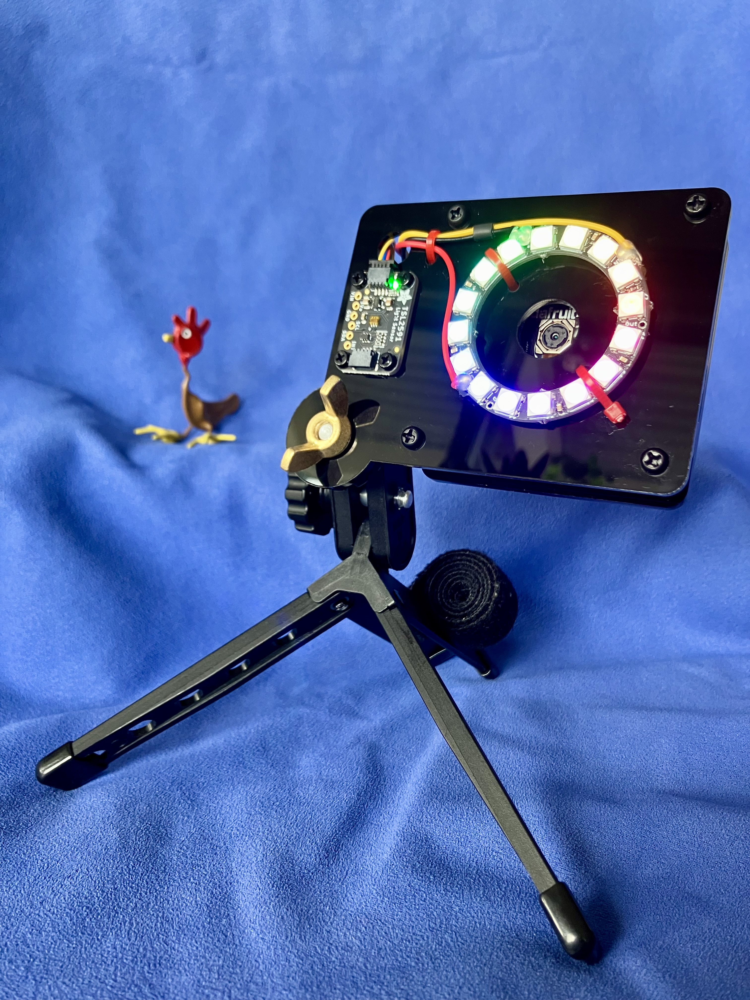

# MEMENTO Case

A laser cut front and back cover for the [Adafruit MEMENTO - Python Programmable DIY Camera](https://www.adafruit.com/product/5420) development board.  Case includes mounting points for an LED ring, a STEMMA QT breakout, and a 1/4 inch tripod post.  My first try at designing a laser cut project!  Inspired by the [Adafruit MEMENTO Camera Enclosure Kit](https://www.adafruit.com/product/5843) which features an RGBW LED ring built into the front plate and a nice silkscreen on all four faces.  

## Usage

Plain SVG file optimized for the Glowforge Pro at my local library makerspace.  

## Assembly

For 1/8" thick acrylic,  
- use 4 x 6mm M3 screws to secure front cover  
- and 4 x 8mm M3 screws plus 8 to 12 x M3 washers as spacers for the back cover  

Optionally:

- [Lithium Ion Polymer Battery with Short Cable - 3.7V 420mAh](https://www.adafruit.com/product/4236)  
- [Adafruit TSL2591 High Dynamic Range Digital Light Sensor - STEMMA QT](https://www.adafruit.com/product/1980)  
- [STEMMA QT / Qwiic JST SH 4-Pin Cable - 50mm Long](https://www.adafruit.com/product/4399)  
- 4 x 6mm M2.5 screws and 4 x M2.5 nuts for STEMMA QT breakout  
- [NeoPixel Ring - 16 x 5050 RGB LED](https://www.adafruit.com/product/1463)  
- [STEMMA JST PH 2mm 3-Pin to Male Header Cable - 200mm](https://www.adafruit.com/product/3893)  
- 3 x mini cable ties, 2mm width to secure LED ring and wires  
- 1/4"-20 wingnut for tripod mount  

## License

[MIT](https://choosealicense.com/licenses/mit/)
